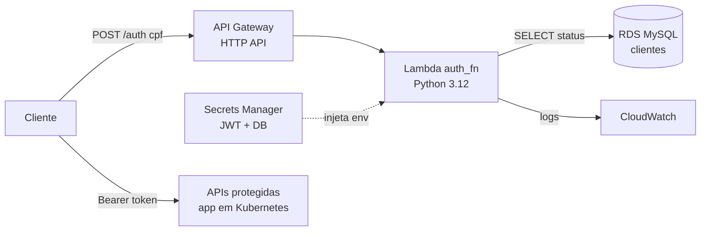

# Serverless Auth — Autenticação por CPF (AWS Lambda)

Function Serverless responsável por autenticar **clientes** da oficina via **CPF**,
emitindo um **JWT** compatível com as APIs protegidas do Auto Center FIAP.

> Parte do Tech Challenge (Fase 3) — este é um dos 4 repositórios exigidos
> (Lambda / Infra K8s / Infra Banco / Aplicação principal).

## Arquitetura



## Fluxo

```
Cliente ──POST /auth {cpf}──▶ API Gateway ──▶ Lambda (Python)
                                                 │
                                1. valida CPF (dígitos verificadores)
                                2. consulta cliente no RDS (existência + status)
                                3. gera JWT (HS256, mesmo secret/issuer do app)
                                                 │
        ◀── 200 {token} | 400 CPF inválido | 404 não encontrado | 403 inativo
```

O token é assinado com **HMAC256 (HS256)**, `issuer = "Auto Center Fiap"`,
`subject = CPF` e claim `tipo = cliente` — o mesmo formato que o app principal
verifica, garantindo que o token seja aceito nas rotas protegidas.

## Tecnologias

- **Python 3.12** (AWS Lambda runtime)
- **PyJWT** — geração do JWT
- **PyMySQL** — acesso ao RDS MySQL
- **pytest** — testes unitários
- **AWS Lambda + API Gateway** (provisionados via Terraform — ver `terraform/`)

## Estrutura

```
autocenter-lambda-auth/
├── src/auth_fn/
│   ├── handler.py       # entrypoint da Lambda (auth_fn.handler.handler)
│   ├── service.py       # orquestra o fluxo de autenticação
│   ├── cpf.py           # validação de CPF (dígitos verificadores)
│   ├── repository.py    # consulta ao RDS MySQL
│   ├── jwt_service.py   # geração do JWT
│   ├── config.py        # variáveis de ambiente
│   └── errors.py        # erros de negócio → status HTTP
├── tests/               # testes unitários (pytest)
├── events/              # eventos de teste local
├── terraform/           # infra (Lambda, API Gateway, VPC, IAM)
├── docs/                # diagrama de sequência + ADRs
├── postman/             # coleção Postman
├── scripts/             # build e invocação local
├── template.yaml        # SAM (execução local)
├── requirements.txt
└── requirements-dev.txt
```

## Executar os testes

```bash
python -m venv .venv
source .venv/Scripts/activate      # Windows: .venv\Scripts\activate
pip install -r requirements-dev.txt
pytest
```

## Execução local

**Sem Docker** (contra um MySQL já com o schema criado, ex.: o do docker-compose do app):

```bash
python scripts/local_invoke.py 11144477735
```

**Com SAM local** (requer Docker):

```bash
sam build
sam local start-api        # expõe POST http://127.0.0.1:3000/auth
# ou uma invocação única:
sam local invoke AuthFunction -e events/auth_event.json
```

## Documentação

- [Diagrama de sequência do fluxo de autenticação](docs/diagrama-sequencia.md)
- [ADR 0001 — Runtime Python em AWS Lambda](docs/adr/0001-runtime-python-aws-lambda.md)
- [ADR 0002 — JWT HMAC com secret compartilhado](docs/adr/0002-jwt-hmac-compartilhado.md)
- [Coleção Postman](postman/serverless-auth.postman_collection.json)

## Variáveis de ambiente

| Variável | Descrição | Default (dev) |
|---|---|---|
| `JWT_SECRET` | Segredo HMAC compartilhado com o app | `123456789` |
| `JWT_ISSUER` | Issuer do token | `Auto Center Fiap` |
| `JWT_EXP_MINUTES` | Expiração em minutos | `30` |
| `DB_HOST` / `DB_PORT` | Host/porta do RDS (**mesmo banco do app**) | `localhost` / `3306` |
| `DB_NAME` | Nome do banco | `autocenterdb` |
| `DB_USER` / `DB_PASSWORD` | Credenciais (prod: usuário **read-only**) | `autocenter` / `autocenter123` |

> **Mesmo banco da aplicação principal:** a Lambda lê a tabela `clientes` do
> **mesmo RDS** que o app usa (`DB_HOST`/`DB_NAME` devem coincidir). Como só faz
> `SELECT`, em produção use um usuário **somente-leitura** dedicado — ver
> [`scripts/create_readonly_user.sql`](scripts/create_readonly_user.sql).
>
> **Produção:** `JWT_SECRET` e `DB_PASSWORD` devem vir do **AWS Secrets Manager**,
> nunca versionados.

## Build & Deploy

**1. Empacotar a função** (código + dependências → `dist/function.zip`):

```bash
./scripts/build.sh          # Windows: ./scripts/build.ps1
```

**2. Provisionar a infra** (Lambda + API Gateway + VPC + IAM) com Terraform:

```bash
cd terraform
cp terraform.tfvars.example terraform.tfvars   # preencha os valores reais
terraform init
terraform apply
```

Ao final, o output `auth_endpoint` traz a URL do `POST /auth`.

> **Pré-requisitos de rede/segredos** (vêm dos outros repos / conta AWS):
> - VPC, subnets privadas e security group do RDS (`vpc_id`, `private_subnet_ids`, `rds_security_group_id`)
> - Secrets no AWS Secrets Manager: senha do banco e **a mesma chave JWT do app** (`db_password_secret_arn`, `jwt_secret_arn`)

## Contrato da API

**Request** `POST /auth`
```json
{ "cpf": "123.456.789-09" }
```

**200 OK**
```json
{
  "token": "eyJhbGciOiJIUzI1Ni...",
  "tokenType": "Bearer",
  "expiraEm": 1755300000,
  "clienteId": 1,
  "nome": "João da Silva"
}
```

**Erros**

| Status | `erro` | Quando |
|---|---|---|
| 400 | `CPF_INVALIDO` | CPF ausente, malformado ou com dígito verificador inválido |
| 404 | `CLIENTE_NAO_ENCONTRADO` | Não existe cliente com esse CPF |
| 403 | `CLIENTE_INATIVO` | Cliente existe mas o status não é `ATIVO` |
| 500 | `ERRO_INTERNO` | Falha inesperada |

## CI/CD (GitHub Actions)

Pipeline em [`.github/workflows/ci-cd.yml`](.github/workflows/ci-cd.yml):

| Gatilho | O que roda |
|---|---|
| Pull Request → `homolog`/`main` | Testes (pytest) + `terraform fmt/validate` |
| Push → `homolog` | Build + `terraform apply` no ambiente **homolog** |
| Push → `main` | Build + `terraform apply` no ambiente **prod** |

**Proteção de branch** (exigida pelo desafio — configurar em *Settings → Branches*):
- `main` e `homolog` protegidas: sem push direto, **Pull Request obrigatório** com aprovação.
- Status checks obrigatórios: `test` e `terraform-validate`.

**Segredos/variáveis do repositório** (necessários para o deploy):

| Tipo | Nome | Descrição |
|---|---|---|
| Secret | `AWS_DEPLOY_ROLE_ARN` | Role assumida via OIDC para o deploy |
| Secret | `DB_PASSWORD_SECRET_ARN` | ARN do secret da senha do banco |
| Secret | `JWT_SECRET_ARN` | ARN do secret da chave JWT (mesma do app) |
| Var | `AWS_REGION`, `VPC_ID`, `RDS_SECURITY_GROUP_ID`, `DB_HOST`, `DB_NAME`, `DB_USER` | Config da infra |
| Var | `PRIVATE_SUBNET_IDS` | Lista JSON, ex.: `["subnet-a","subnet-b"]` |

> Para o deploy em CI persistir o estado entre execuções, habilite o **backend S3**
> (bloco comentado em `terraform/versions.tf`).

## Status do trabalho

- [x] Fase 1 — Scaffold Python
- [x] Fase 2 — Lógica (cpf / repository / jwt / service / handler) + testes unitários
- [x] Fase 3 — Coluna `status` na tabela `clientes` + CPFs de seed corrigidos (migração V13)
- [x] Fase 4 — Terraform (Lambda + API Gateway HTTP + VPC + IAM + Secrets Manager) — `terraform validate` OK
- [x] Fase 5 — CI/CD (GitHub Actions: testes + validate em PR, deploy automático em homolog/main)
- [x] Fase 6 — Execução local (SAM template + `local_invoke.py`)
- [x] Fase 7 — Docs (diagrama de sequência, 2 ADRs, coleção Postman)
