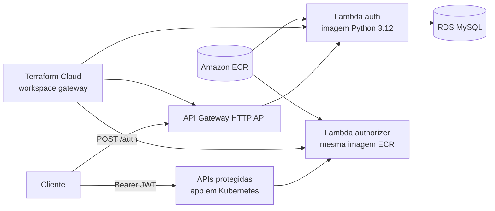

# Serverless Auth — Autenticação por CPF (AWS Lambda)

Função serverless responsável por autenticar **clientes** da oficina via **CPF**
e emitir um **JWT** compatível com as APIs protegidas do Auto Center FIAP.

## Arquitetura



## Fluxo

```text
Cliente ──POST /auth {cpf}──▶ API Gateway ──▶ Lambda auth
                                                 │
                                1. valida CPF
                                2. consulta cliente no RDS
                                3. gera JWT HS256
                                                 │
        ◀── 200 {token} | 400 CPF inválido | 404 não encontrado | 403 inativo
```

O authorizer reutiliza a **mesma imagem publicada no ECR**, mas com comando
Lambda diferente (`auth_fn.authorizer.handler`).

## Tecnologias

- Python 3.12
- AWS Lambda com `package_type = "Image"`
- Amazon ECR
- API Gateway HTTP API
- Terraform Cloud
- PyJWT
- PyMySQL
- pytest

## Estrutura

```text
autocenter-lambda-auth/
├── Dockerfile
├── src/auth_fn/
├── tests/
├── events/
├── terraform/
├── docs/
├── postman/
├── scripts/
├── template.yaml
├── requirements.txt
└── requirements-dev.txt
```

## Testes locais

```bash
python -m venv .venv
source .venv/bin/activate
pip install -r requirements-dev.txt
pytest -q
terraform -chdir=terraform init -backend=false -input=false
terraform -chdir=terraform fmt -check -recursive
terraform -chdir=terraform validate
terraform -chdir=terraform test
```

## Execução local

Sem Docker, apontando para um banco já disponível:

```bash
python scripts/local_invoke.py 11144477735
```

Com SAM local:

```bash
sam build
sam local start-api
```

Build local da imagem Lambda:

```bash
IMAGE_TAG=autocenter-lambda-auth:local bash scripts/build.sh
# Windows PowerShell:
# $env:IMAGE_TAG="autocenter-lambda-auth:local"; ./scripts/build.ps1
```

## Workspace Terraform Cloud (`gateway`)

Configuração esperada:

- **Organização:** `autocenter-fiap`
- **Workspace:** `gateway`
- **Working directory:** `terraform/`
- **Modo recomendado para o workflow:** API/CLI-driven

### Pré-requisitos de remote state

O workspace `gateway` consome outputs dos workspaces:

- `infraestrutura`: `vpc_id`, `private_subnet_ids`, `eks_cluster_name`
- `database`: `rds_security_group_id`, `rds_endpoint`, `db_name`, `db_user`
- `aplicacao`: `application_service_name`, `application_namespace`

Se algum output não existir, use as variáveis de fallback em `terraform.tfvars`
ou nas variáveis não sensíveis do workspace.

### Variáveis sensíveis do workspace

Configure **somente** no Terraform Cloud:

- `db_password`
- `jwt_secret`

> Nenhum `terraform.tfvars` com segredos deve ser versionado neste repositório.

### Variáveis não sensíveis do workspace

Obrigatórias neste repositório:

- `aws_region`
- `project_name`
- `environment`
- `eks_node_group_name`
- `allowed_origins`

Obrigatórias apenas se o remote state correspondente não fornecer o valor:

- `vpc_id`
- `private_subnet_ids`
- `rds_security_group_id`
- `db_host`
- `db_name`
- `db_user`
- `application_service_name`
- `application_namespace`

Variável de deploy injetada pelo CI a cada run remoto:

- `lambda_image_uri`

O arquivo [`terraform/terraform.tfvars.example`](terraform/terraform.tfvars.example)
mostra somente placeholders **não sensíveis**.

## CI/CD

Pipeline em [`.github/workflows/ci-cd.yml`](.github/workflows/ci-cd.yml):

| Gatilho | O que roda |
| --- | --- |
| Pull Request → `homolog`/`main` | `pytest -q`, `terraform fmt -check -recursive`, `terraform validate`, `terraform test` |
| Push → `homolog`/`main` | Build da imagem, push para o ECR e acionamento remoto do workspace `gateway` |

### Publicação da imagem

O workflow:

1. assume a role AWS via OIDC **somente** para publicar a imagem no ECR;
2. monta a URI final da imagem com a tag baseada no commit;
3. gera um `deploy.auto.tfvars.json` efêmero com `lambda_image_uri`;
4. envia a configuração ao Terraform Cloud e cria o run remoto;
5. confirma o apply via API somente se o run ficar aguardando aprovação.

Nenhum `terraform apply` é executado localmente no GitHub Actions.

### Variáveis/segredos do GitHub Actions

| Tipo | Nome | Uso |
| --- | --- | --- |
| Secret | `AWS_DEPLOY_ROLE_ARN` | Role OIDC usada para `docker push` no ECR |
| Secret | `TF_API_TOKEN` | Necessário para upload da configuração e criação do run remoto no Terraform Cloud |
| Variable | `AWS_REGION` | Região AWS do repositório ECR |
| Variable | `LAMBDA_ECR_REPOSITORY_URL` | URL do repositório ECR já existente, copiada do output exposto pelo workspace `infraestrutura` |

Se `TF_API_TOKEN` não estiver configurado, o workflow **publica a imagem** e
emite um aviso, mas não consegue criar o run remoto automaticamente.

## Variáveis de ambiente da Lambda

| Variável | Descrição | Default local |
| --- | --- | --- |
| `JWT_SECRET` | Segredo HMAC compartilhado com o app | `123456789` |
| `JWT_ISSUER` | Issuer do token | `Auto Center Fiap` |
| `JWT_EXP_MINUTES` | Expiração em minutos | `30` |
| `DB_HOST` / `DB_PORT` | Host/porta do RDS | `localhost` / `3306` |
| `DB_NAME` | Nome do banco | `autocenterdb` |
| `DB_USER` / `DB_PASSWORD` | Credenciais | `autocenter` / `autocenter123` |
| `DB_CONNECT_TIMEOUT` | Timeout de conexão | `5` |

Em produção, `JWT_SECRET` e `DB_PASSWORD` entram via variáveis sensíveis do
workspace `gateway`, sem Secrets Manager e sem arquivos versionados com segredos.

## Contrato da API

**Request** `POST /auth`

```json
{ "cpf": "123.456.789-09" }
```

**200 OK**

```json
{
  "token": "******",
  "tokenType": "Bearer",
  "expiraEm": 1755300000,
  "clienteId": 1,
  "nome": "João da Silva"
}
```

**Erros**

| Status | `erro` | Quando |
| --- | --- | --- |
| 400 | `CPF_INVALIDO` | CPF ausente, malformado ou inválido |
| 404 | `CLIENTE_NAO_ENCONTRADO` | Não existe cliente com esse CPF |
| 403 | `CLIENTE_INATIVO` | Cliente existe, mas não está ativo |
| 500 | `ERRO_INTERNO` | Falha inesperada |

## Documentação

- [Diagrama de sequência](docs/diagrama-sequencia.md)
- [ADR 0001 — Runtime Python em AWS Lambda](docs/adr/0001-runtime-python-aws-lambda.md)
- [ADR 0002 — JWT HMAC com secret compartilhado](docs/adr/0002-jwt-hmac-compartilhado.md)
- [Coleção Postman](postman/serverless-auth.postman_collection.json)
