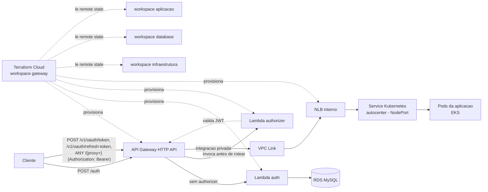

# Resumo — API Gateway do Auto Center FIAP

Este documento resume **como funciona** e **como configurar** o API Gateway
implementado neste repositório (`autocenter-lambda-auth`), que passou a ser
o **único ponto de entrada público** da plataforma Auto Center FIAP.

## 1. Como funciona

### 1.1 Visão geral da arquitetura



O gateway é um **HTTP API do Amazon API Gateway**, provisionado via
Terraform Cloud, que expõe publicamente as rotas da aplicação sem expor o
cluster EKS diretamente. Ele decide, por rota, se a requisição precisa de
autenticação e para onde deve ser encaminhada:

| Rota | Autenticação | Destino |
| --- | --- | --- |
| `POST /auth` | Nenhuma | Lambda `auth` (login por CPF, gera JWT) |
| `POST /v1/oauth/token` | Nenhuma | Integração privada → aplicação (EKS) |
| `POST /v1/oauth/refresh-token` | Nenhuma | Integração privada → aplicação (EKS) |
| `ANY /{proxy+}` | Lambda Authorizer (JWT) | Integração privada → aplicação (EKS) |

### 1.2 Fluxo de autenticação do cliente (CPF → JWT)

```text
Cliente ──POST /auth {cpf}──▶ API Gateway ──▶ Lambda auth
                                                 │
                                1. valida CPF
                                2. consulta cliente no RDS (somente leitura)
                                3. gera JWT assinado (HS256)
                                                 │
        ◀── 200 {token} | 400 CPF inválido | 404 não encontrado | 403 inativo
```

### 1.3 Fluxo de autorização (acesso às rotas protegidas)

1. O cliente chama qualquer rota protegida com `Authorization: Bearer <token>`.
2. O API Gateway invoca a **Lambda Authorizer** (tipo `CUSTOM`, `simple
   responses`) antes de rotear a chamada.
3. O Authorizer decodifica o JWT usando o mesmo segredo HMAC (`jwt_secret`),
   valida `issuer` e **exige a claim `exp`** (tokens sem expiração são
   sempre rejeitados).
4. Se válido, o API Gateway encaminha a requisição via **VPC Link → NLB
   interno → Service Kubernetes (NodePort)** até os pods da aplicação no
   EKS. Se inválido, retorna `401` sem nunca alcançar o cluster.

### 1.4 Por que o gateway "descobre" o NodePort em vez de o repositório `autocenter` expor uma porta fixa?

Por restrição do escopo aprovado, **nenhuma alteração foi feita nos
repositórios `infraestrutura`, `database` e `autocenter`**. Em vez de pedir
para o `autocenter` publicar um Service com porta fixa, o Terraform deste
repositório faz uma leitura **somente-leitura** (`data "kubernetes_service"
"application"`) do Service já existente, e extrai o `NodePort` atual
dinamicamente para apontar o Target Group do NLB.

### 1.5 Onde vivem as duas Lambdas

Ambas as funções (`auth` e `authorizer`) são publicadas a partir da
**mesma imagem de container no ECR** (`package_type = "Image"`), mudando
apenas o `image_config.command`:

- `auth_fn.handler.handler` → Lambda `auth`
- `auth_fn.authorizer.handler` → Lambda `authorizer`

Isso evita duplicar Dockerfile/dependências e mantém as duas funções sempre
na mesma versão de código.

### 1.6 Segredos (sem AWS Secrets Manager)

Por se tratar de uma conta **AWS Academy** (sem permissão para criar/gerir
Secrets Manager com liberdade), os segredos usados pela aplicação
(`db_password`, `jwt_secret`) são **variáveis sensíveis do workspace
Terraform Cloud `gateway`**, injetadas diretamente como variáveis de
ambiente da Lambda. Essa é uma decisão de escopo aprovada — o risco aceito
é que esses valores ficam registrados no state do Terraform Cloud (que já
é, por si, um backend remoto controlado/criptografado).

## 2. Como configurar

### 2.1 Pré-requisitos

- Conta AWS Academy com sessão ativa (gera credenciais temporárias:
  `AWS_ACCESS_KEY_ID`, `AWS_SECRET_ACCESS_KEY`, `AWS_SESSION_TOKEN`).
- Organização `autocenter-fiap` no Terraform Cloud, com os workspaces
  `infraestrutura`, `database` e `aplicacao` **já aplicados** (fornecem o
  remote state consumido por este gateway).
- Conta no Amazon ECR já criada pelo repositório `infraestrutura`
  (`ecr.tf`), pois a imagem das Lambdas é publicada lá.

### 2.2 Criar o workspace `gateway` no Terraform Cloud

1. Acesse a organização `autocenter-fiap` em https://app.terraform.io.
2. Crie um novo workspace chamado `gateway`.
3. Conecte ao repositório `autocenter-lambda-auth`, com **Terraform
   Working Directory** = `terraform/`.
4. Confirme que os workspaces `infraestrutura`, `database` e `aplicacao`
   já existem na mesma organização (o `gateway` lê o `outputs` deles via
   `terraform_remote_state`).

### 2.3 Variáveis do workspace `gateway`

**Sensíveis (categoria Terraform, marcar "Sensitive"):**

| Nome | Descrição |
| --- | --- |
| `db_password` | Senha do MySQL no RDS (igual ao `db_password` do workspace `database`) |
| `jwt_secret` | Segredo HMAC compartilhado com a aplicação (`sistema.seguranca.chave.secreta`) |

**Não sensíveis, obrigatórias:**

| Nome | Descrição |
| --- | --- |
| `aws_region` | Região AWS (ex.: `us-east-1`) |
| `project_name` | Prefixo usado para nomear os recursos |
| `environment` | Ambiente (`homolog`, `prod`, etc.) |
| `eks_node_group_name` | Nome do node group do EKS |
| `allowed_origins` | Origens permitidas pelo CORS do HTTP API |

**Não sensíveis, apenas se o remote state correspondente não fornecer o
valor** (fallback): `vpc_id`, `private_subnet_ids`, `rds_security_group_id`,
`db_host`, `db_name`, `db_user`, `application_service_name`,
`application_namespace`.

**Injetada automaticamente pelo pipeline de CI/CD** (não configurar
manualmente): `lambda_image_uri`.

> Nunca versionar um `terraform.tfvars` com valores reais. Use
> [`terraform/terraform.tfvars.example`](terraform/terraform.tfvars.example)
> apenas como referência de placeholders.

### 2.4 Segredos no GitHub Actions

No repositório `autocenter-lambda-auth`, em **Settings → Secrets and
variables → Actions**, configure:

| Nome | Uso |
| --- | --- |
| `TF_API_TOKEN` | Token de API do Terraform Cloud (organização `autocenter-fiap`) |
| `AWS_ACCESS_KEY_ID` / `AWS_SECRET_ACCESS_KEY` / `AWS_SESSION_TOKEN` | Credenciais temporárias da sessão AWS Academy (necessárias para build/push da imagem no ECR) |

> As credenciais da sessão AWS Academy expiram junto com o laboratório —
> devem ser atualizadas manualmente nesse local sempre que a sessão reiniciar.

### 2.5 Validar localmente antes de subir

```bash
python -m venv .venv
source .venv/bin/activate
pip install -r requirements-dev.txt
pytest -q

terraform -chdir=terraform init -backend=false -input=false
terraform -chdir=terraform fmt -check -recursive
terraform -chdir=terraform validate
terraform -chdir=terraform test
```

### 2.6 Deploy

O pipeline (`.github/workflows/ci-cd.yml`) builda a imagem, publica no ECR
e aciona o workspace `gateway` no Terraform Cloud a cada push nas branches
configuradas. Após o apply, o workspace expõe (em **Outputs**):

- `auth_endpoint` — URL completa para `POST /auth`
- `api_endpoint` — URL base do HTTP API (use para montar as demais rotas)
- `internal_nlb_dns_name` — DNS interno do NLB (uso somente interno/depuração)

### 2.7 Testar o gateway já implantado

```bash
# 1. Autenticar por CPF e obter o JWT
curl -X POST "<api_endpoint>/auth" \
  -H "Content-Type: application/json" \
  -d '{"cpf": "123.456.789-09"}'

# 2. Chamar uma rota protegida usando o token retornado
curl "<api_endpoint>/v1/clientes" \
  -H "Authorization: Bearer <token>"
```

## 3. Documentos relacionados

- [`README.md`](README.md) — detalhes técnicos completos (estrutura de
  pastas, contrato da API, execução local, variáveis de ambiente da Lambda).
- [`docs/adr/0001-runtime-python-aws-lambda.md`](docs/adr/0001-runtime-python-aws-lambda.md)
- [`docs/adr/0002-jwt-hmac-compartilhado.md`](docs/adr/0002-jwt-hmac-compartilhado.md)
- [`docs/superpowers/specs/2026-09-09-api-gateway-design.md`](docs/superpowers/specs/2026-09-09-api-gateway-design.md)
- [`docs/superpowers/plans/2026-09-09-api-gateway.md`](docs/superpowers/plans/2026-09-09-api-gateway.md)
