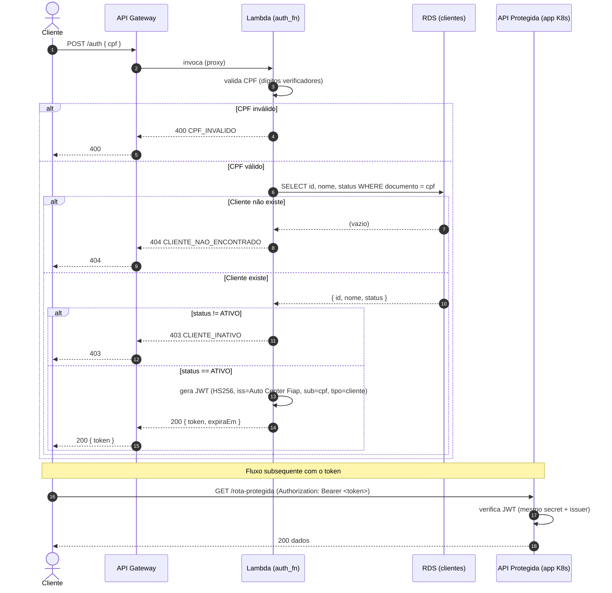

# Diagrama de Sequência — Autenticação por CPF

Fluxo completo desde a requisição do cliente até o consumo de uma API protegida.

## Observações

- O JWT é assinado com o **mesmo secret e issuer** do app principal, então as
  APIs protegidas validam o token sem chamar a Lambda novamente (stateless).
- A claim `tipo=cliente` distingue o token de cliente dos tokens de usuário interno.
- A Lambda tem acesso **somente leitura** à tabela `clientes`.
